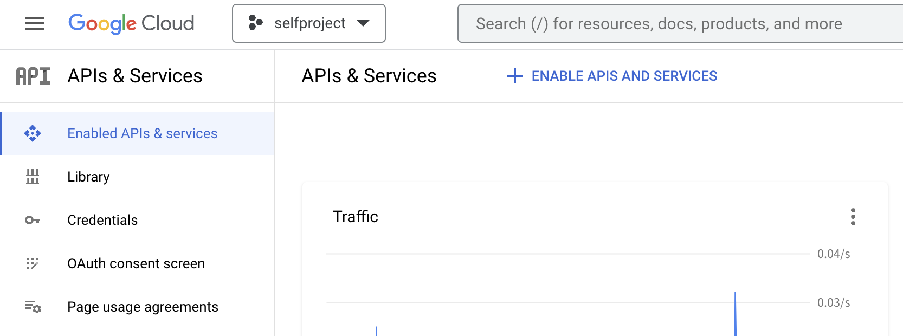
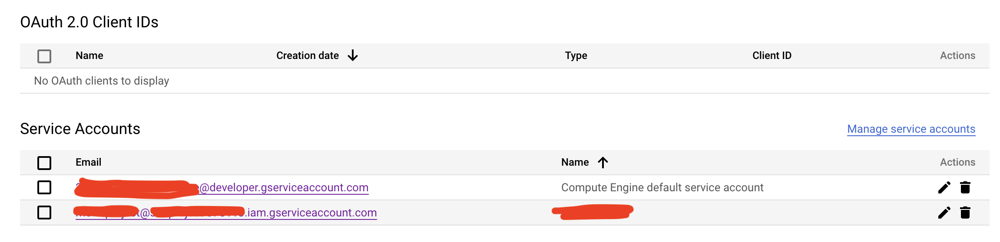
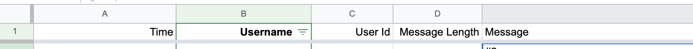

# Telegram-messages-to-Google-Sheets

You can listen to a public or private channel, group, and even a personal chat using this method **without** any bots or administrator permission.

# Requirement

- Python >= 3.7
- datetime
- pandas==0.3.1
- [pygsheets](https://pygsheets.readthedocs.io/en/stable/)==2.0.6
- [Telethon](https://github.com/LonamiWebs/Telethon) @ https://github.com/LonamiWebs/Telethon/archive/v1.zip

# Before Start

## Telegram Settings

1. Visit https://my.telegram.org/ and login to your Telegram account with the phone number of the developer account to use.
2. Click `API development tools` to get the `App api_id` and `App api_hash`.
3. Get channel or chat ID via different methods:
   - Copy the invite link (if it exists, public channel normally).
   - Open `https://web.telegram.org/` and select your chat room, the website might like `https://web.telegram.org/z/#-123456789`, copy the number after `/#` (include the negative symbol). In this case, it is `-123456789`.
   - Run the code (ref: https://docs.telethon.dev/en/stable/basic/quick-start.html), it will print all the dialogs/conversations that you are part of.

```
from telethon import TelegramClient

api_id = INT_TELEGRAM_API_ID
api_hash = 'STR_TELEGRAM_API_HASH'
client = TelegramClient('session', api_id, api_hash)

async def main():
    async for dialog in client.iter_dialogs():
        print(dialog.name, 'has ID', dialog.id)
with client:
    client.loop.run_until_complete(main())
```

4. Remember that your API hash is secret and Telegram won’t let you revoke it. Don’t post it anywhere!


## Google API Settings

1. Visit [Google API Console](https://console.developers.google.com/) and create a new project.
2. In this new project, click `APIs & Services > +ENABLE APIS AND SERVICES`.



3. Find `Google Sheets API` and enable it.
4. Back to `APIs & Services`, select Credentials in the sidebar.
5. Click `+ CREATE CREDENTIALS > Service Account` and follow the instructions.
6. Download credential JSON file and name it `credentials.json`.
7. Back to `Credentials`, you'll see a new Service Accounts below. Copy the Email (`...@...iam.gserviceaccount.com`).



## Google Sheets Settings

1. Create a new Google Sheets.
2. Click the `Share` or `Send` button in the upper right corner.
3. Invite the Service Account Email we created above as an editor.
4. Name the Sheet. For example, `chats`.
5. The first row (column name) is `Time | Username | User Id | Message Length | Message`. You can create the column data filters later.



# Run

- Run it on a 24/7 machine or VPS.
- To listen the chat, run `listen.py`
- To crawl the history chat, run `crawl-history.py`. Check [here](https://docs.telethon.dev/en/stable/modules/client.html?highlight=iter_messages#telethon.client.messages.MessageMethods.iter_messages) to find more detail of `iter_messages()` function.